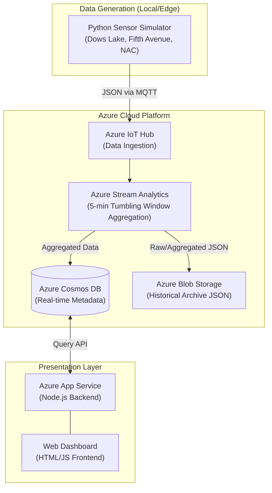

# Rideau Canal Skateway - Real-Time Monitoring System

- **Name:** Shan Jiang
- **Student ID:** 041179466
- **Course:** CST8916 - Winter 2026
- **Video Demo:** [Demo Video]（https://youtu.be/pX3gUQLK5eI）

## Project Overview
This project is an end-to-end real-time IoT monitoring system designed for the Rideau Canal Skateway. It simulates telemetry data (ice thickness, temperatures, snow accumulation) from multiple locations, ingests the data via Azure IoT Hub, processes it using Azure Stream Analytics, and visualizes the safety conditions on a live web dashboard.

---

## 🔗 Project Repositories
As per the project requirements, the system is divided into three separate repositories:

1. **[Main Documentation Repository](https://github.com/Shan-AC/rideau-canal-monitoring)** *(This Repository)*
   * Contains architecture diagrams, deployment screenshots, and the Stream Analytics SQL query.
2. **[Sensor Simulation Repository](https://github.com/Shan-AC/rideau-canal-sensor-simulation)**
   * Contains the Python script that simulates multi-threaded IoT devices and sends data to Azure.
3. **[Web Dashboard Repository](https://github.com/Shan-AC/rideau-canal-dashboard)**
   * Contains the Node.js/Express backend and HTML/JS frontend that pulls live data from Cosmos DB.

---

## 🏗️ System Architecture

### Component Details
* **Azure IoT Hub:** Acts as the central message broker, receiving JSON payloads every 10 seconds from three distinct sensor locations.
* **Azure Stream Analytics:** Processes the live data stream using a `TumblingWindow(minute, 5)` to calculate the average, minimum, and maximum values of the telemetry.
* **Azure Cosmos DB:** Stores the aggregated results for real-time low-latency retrieval by the web dashboard.
* **Azure Blob Storage:** Acts as cold storage, archiving all JSON outputs organized by `{date}/{time}` for historical auditing.

---

## 📸 Deployment Screenshots
All evidence of the working cloud infrastructure is located in the `screenshots/` directory:

* `01-iot-hub-devices.png`: Registered IoT devices (DowsLake, NAC, FifthAvenue).
* `02-iot-hub-metrics.png`: IoT Hub metrics showing incoming messages.
* `03-stream-analytics-query.png`: The SAQL query used for data aggregation.
* `04-stream-analytics-running.png`: Stream Analytics job in the "Running" state.
* `05-cosmos-db-data.png`: Aggregated JSON documents successfully stored in Cosmos DB.
* `06-blob-storage-files.png`: Historical data files automatically created in Blob Storage.
* `07-dashboard-local.png`: The functional live web dashboard (Localhost).
* `08-dashboard-azure.png`: Attempted Azure App Service deployment.

---

### Key Learning
The most significant takeaway from this project was gaining a deep, practical understanding of **End-to-End Cloud IoT Architecture**. Connecting the dots between data generation (Python), data ingestion (IoT Hub), real-time processing (Stream Analytics), and multi-tier storage taught me how to manage data pipelines in the cloud. Additionally, the quota issue provided a highly realistic lesson in **Cloud Economics** and the importance of monitoring resource consumption.

---

## 🤖 AI Usage Disclosure
*As per course requirements, I declare that Generative AI (Gemini) was utilized to assist in writing the Python threading logic, structuring the Node.js Express API, formatting the Mermaid architecture diagram, and drafting this README documentation.*